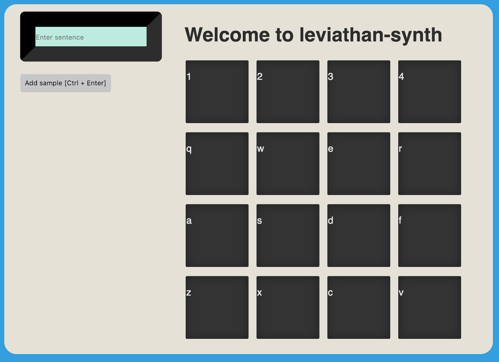

# leviathan-synth

An MPC-style soundboard using a mix of sampled and synthesised voices.
Written in Clojure and Clojurescript.

## Installation

```sh
lein deps
```

```sh
lein cljsbuild once
```

```sh
lein run
```

Visit http://localhost:9009 in your browser.




